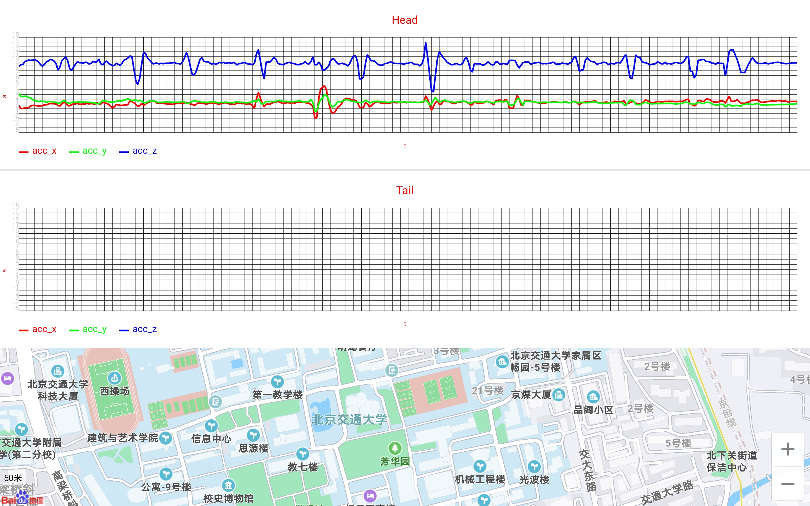

# oppo & mi car 🕊️ pro.

This repository is based on the project, **Research on Road Obstacle Analysis Based on Road Data**.  In the project, we focus on the data collected by the ninebot with two android phones. During the running on the road, the sensor in the phones can get the acceleration and position of the ninebot. After getting data form several experiments, we can analyze the data by machine learning technologies, such as SVM, K-Means, LSTM and so on. The purpose of this project is to get the position of road obstacle just by android phones and their sensors. In this way, we can master road condition information easily, which is also inexpensive.

In this repository, we offer some android projects we need in the project. 

-  SensorInAndroid - Collect data by sensors in android phones

- TransBetweenAndroid - Data panel in android tablet (Huawei matepad pro) 

- PCServer - Data panel on Windows laptop

- SyncTime - Synchronize the system time of two phones
  - It is recommended to use mobile phones of the same brand to ensure the same sampling frequency (We use phones made by mi brand)
  - It needs to be root
- NineBot

